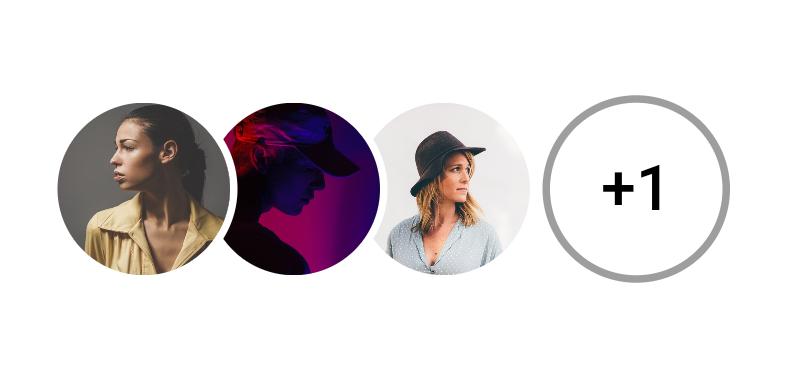

# image_stack

`image_stack` is a pure dart package for creating image stack in Flutter. This package give you a `widget` to easily create image stack for your need.

UI created by this package is mainly found in profile picture stacks in so many apps but it can be used at any place where you feel it will look good.

## Installation

In the dependencies: section of your `pubspec.yaml`, add the following line:

```yaml
image_stack: <latest_version>
```

## Usage

```dart
import 'package:image_stack/image_stack.dart';

class MyWidget extends StatelessWidget {
  List<string> = ["image1Link", "image2Link", "image3Link", "image4Link"];

  Widget build(BuildContext context) {
    return ImageStack(
            imageList: images,
            imageRadius: 25, // Radius of each images
            imageCount: 3, // Maximum number of images to be shown in stack
            imageBorderColor: 3, // Border width around the images
        );
  }
}
```

## Example

View the Flutter app in the `example` directory.

## Screenshot



## Contributors

- [Karan Shah](https://github.com/karan413255)
- [Piyush Maurya](https://github.com/piyushmaurya23/)
